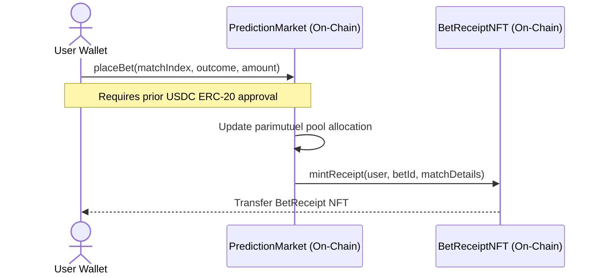
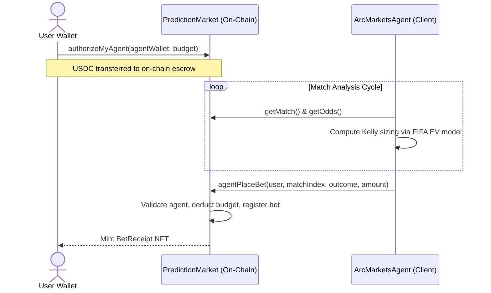

# ArcMarkets: Decentralized Prediction Markets on Arc Network

[](https://rpc.testnet.arc.network)
[](https://testnet.arcscan.app)
[](./LICENSE)
[](https://hardhat.org)

ArcMarkets is a fully on-chain, peer-to-peer prediction protocol deployed on the **Arc Network**. By leveraging Arc's native USDC gas model, participants can deposit funds, place wagers, and settle transaction fees entirely in USDC — eliminating the traditional onboarding friction associated with maintaining a separate native gas token.

---

## Table of Contents

- [Key Innovations](#key-innovations)
- [Architecture Overview](#architecture-overview)
- [Deployed Contracts](#deployed-contracts)
- [Quick Start](#quick-start)
- [Hardhat Scripts Reference](#hardhat-scripts-reference)
- [Interaction Flows](#interaction-flows)
- [Technical Documentation](#technical-documentation)

---

## Key Innovations

### Dynamic Parimutuel Pooling

All wagers on a given event consolidate into a single unified on-chain liquidity pool. Odds adjust continuously in real time based on the distribution of capital across outcomes:

$$\text{Odds}_i = \frac{\text{Total Pool} \times (1 - \text{Fee})}{\text{Outcome Pool}_i}$$

This eliminates the need for direct counterparties and ensures that every participant competes against the aggregate market rather than a house edge.

### Escrowed AI Agent Delegation

Users escrow a USDC budget directly on-chain and authorize an off-chain AI agent to analyze live sports fixtures using FIFA strength ratings. The agent autonomously identifies positive expected-value opportunities and sizes wagers using the **Kelly Criterion** — without ever requiring access to user private keys. Budget revocation is instant and fully user-controlled.

### 100% On-Chain SVG NFT Receipts

Every confirmed wager mints an ERC-721 token containing a fully on-chain SVG receipt generated directly by the smart contract. Bet amount, teams, prediction outcome, and transaction timestamp are Base64-encoded on-chain — ensuring permanent, decentralized visual provenance for every prediction.

---

## Architecture Overview

```
ArcMarkets/
├── contracts/
│   ├── PredictionMarket.sol     # Core parimutuel pooling and USDC budget escrow
│   ├── BetReceiptNFT.sol        # On-chain dynamic SVG receipt ERC-721 generator
│   └── MockUSDT.sol             # Mock ERC-20 token for local development and testing
├── scripts/
│   ├── deploy.js                # Contract compilation and deployment
│   ├── create-match.js          # Admin: create a new match fixture
│   ├── resolve-match.js         # Admin: resolve match outcome and trigger payouts
│   ├── add-live-matches.js      # Seed live fixture data for testing
│   ├── resolve-all-live.js      # Batch settlement utility for seeded fixtures
│   ├── authorize-agent.js       # Whitelist an AI agent wallet address
│   ├── fund-agent.js            # Fund an agent's escrow balance
│   ├── check-contracts.js       # Validate deployment state and addresses
│   └── check-min-bet.js         # Validate betting limit configurations
├── frontend/
│   ├── src/
│   │   ├── agent/               # ArcMarketsAgent.js — Kelly Criterion client engine
│   │   ├── app/                 # Next.js layout, API routes, and page views
│   │   ├── hooks/               # Custom React hooks: useMatches, useWallet, useAgent
│   │   └── utils/               # ethers.js client configs and contract ABIs
│   └── package.json
├── hardhat.config.js            # Hardhat configuration with Arc Testnet network settings
├── WHITEPAPER.md                # In-depth mathematical and engineering specification
└── package.json                 # Root Hardhat workspace configuration
```

---

## Deployed Contracts

All contracts are live on the **Arc Testnet** (Chain ID: `5042002`):

| Contract | Address | Explorer |
|---|---|---|
| **PredictionMarket** | `0xbE2bf8f1c34a0517Dfd8732d4b8A82056DB539B4` | [View on Arcscan](https://testnet.arcscan.app/address/0xbE2bf8f1c34a0517Dfd8732d4b8A82056DB539B4) |
| **BetReceiptNFT** | `0xEfDdb2C5788E426d0AE18a62B74a84A8c86972dE` | [View on Arcscan](https://testnet.arcscan.app/address/0xEfDdb2C5788E426d0AE18a62B74a84A8c86972dE) |
| **USDC Predeploy** | `0x3600000000000000000000000000000000000000` | [View on Arcscan](https://testnet.arcscan.app/address/0x3600000000000000000000000000000000000000) |

---

## Quick Start

### Prerequisites

- **Node.js** v18 or higher
- **MetaMask** or any EIP-1193-compatible wallet configured for Arc Testnet
- Testnet USDC from the [Circle Faucet](https://faucet.circle.com/) (select Arc Testnet)

### 1. Install Dependencies

```bash
# Root workspace (Hardhat tooling)
npm install

# Frontend Next.js client
cd frontend && npm install && cd ..
```

### 2. Configure Environment Variables

Create a `.env` file in the project root:

```env
PRIVATE_KEY=your_deployer_private_key_here
USDC_ADDRESS=0x3600000000000000000000000000000000000000
```

Create `frontend/.env.local` for the client DApp:

```env
NEXT_PUBLIC_ARC_RPC_URL=https://rpc.testnet.arc.network
NEXT_PUBLIC_USDC_ADDRESS=0x3600000000000000000000000000000000000000
NEXT_PUBLIC_MARKET_ADDRESS=0xbE2bf8f1c34a0517Dfd8732d4b8A82056DB539B4
NEXT_PUBLIC_NFT_ADDRESS=0xEfDdb2C5788E426d0AE18a62B74a84A8c86972dE
```

### 3. Launch the DApp

```bash
cd frontend
npm run dev
```

Navigate to [http://localhost:3000](http://localhost:3000) in your browser.

---

## Hardhat Scripts Reference

```bash
# Compile all smart contracts
npx hardhat compile

# Deploy contracts to Arc Testnet (updates deployment.json)
npx hardhat run scripts/deploy.js --network arcTestnet

# Verify deployment addresses and configuration
npx hardhat run scripts/check-contracts.js --network arcTestnet

# Seed initial match fixtures
npx hardhat run scripts/add-live-matches.js --network arcTestnet

# Authorize an AI agent wallet address
AGENT=0xYourAgentAddress npx hardhat run scripts/authorize-agent.js --network arcTestnet

# Resolve a match and distribute payouts
MATCH_INDEX=0 RESULT=1 npx hardhat run scripts/resolve-match.js --network arcTestnet
```

---

## Interaction Flows

### Standard Betting Flow



### AI Agent Delegation Flow



---

## Technical Documentation

For a complete breakdown of the parimutuel pricing mechanics, Kelly Criterion sizing derivation, risk profile parameters, and on-chain SVG encoding specification, refer to the [WHITEPAPER.md](./WHITEPAPER.md).

---

*Built on Arc Testnet.*
