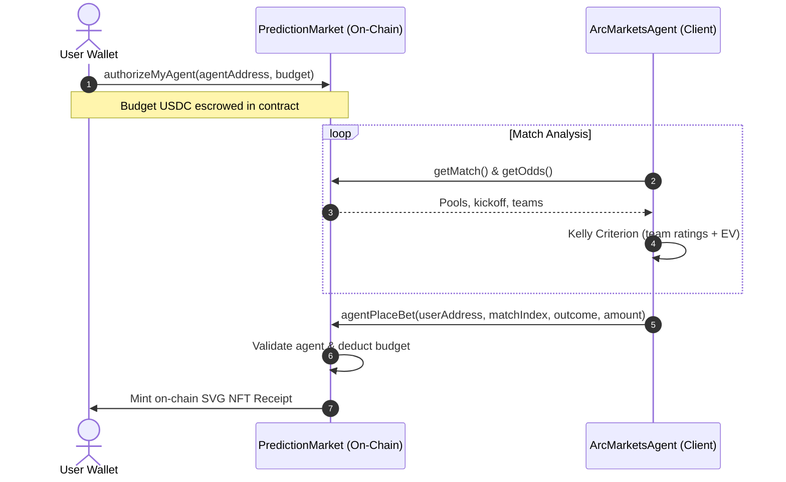

# 🔮 ArcMarkets — Prediction Market on Arc Testnet

> **Parimutuel Pooling** · **AI Agent Delegation** · **100% On-Chain SVG NFT Receipts**  
> Deployed on **Arc Testnet** — the first EVM chain where USDC is the native gas token.

## Quick Links

| | |
|---|---|
| **Explorer** | [testnet.arcscan.app](https://testnet.arcscan.app) |
| **Developer** | [@Ritesh5969](https://x.com/Ritesh5969) |
| **Powered by** | Arc Network · Ethers.js · Next.js |

---

## What is ArcMarkets?

ArcMarkets is a decentralised, peer-to-peer prediction market built on Arc Testnet.  
Users can bet USDC on outcomes across **sports** (football fixtures) and **crypto** (BTC/ETH head-to-head markets).

Two core innovations set ArcMarkets apart:

**Parimutuel Odds Pricing** — All wagers on a match consolidate into a single on-chain pool. Odds adjust dynamically with every new bet. Winners split the pool minus a 2% protocol fee.

**Autonomous AI Agent Delegation** — Users can escrow a USDC budget on-chain and authorise a built-in AI agent to place mathematically optimised bets using the Kelly Criterion — without ever giving up their private key.

---

## Why Arc?

Arc is the first L2 where **USDC is the native gas token** — you pay gas with USDC, not ETH.  
This means ArcMarkets users bet *and* pay fees in the same token, with no native ETH required.

- **Chain ID:** `5042002`  
- **RPC:** `https://rpc.testnet.arc.network`  
- **Explorer:** `https://testnet.arcscan.app`  
- **Native token:** USDC (`0x3600000000000000000000000000000000000000`)

---

## Architecture

```
ArcMarkets/
├── contracts/
│   ├── PredictionMarket.sol   # Core parimutuel betting contract & USDC escrow pool
│   ├── BetReceiptNFT.sol      # 100% on-chain SVG NFT receipt generator (ERC-721)
│   └── MockUSDT.sol           # Mock ERC-20 for local/hardhat testing only
├── scripts/
│   ├── create-match.js        # Admin: create matches on-chain
│   ├── resolve-match.js       # Admin: resolve matches on-chain
│   ├── authorize-agent.js     # Admin: whitelist an agent wallet
│   ├── check-contracts.js     # Verify deployment state
│   └── test-rpc.js            # Verify RPC connectivity
├── frontend/
│   ├── src/
│   │   ├── agent/             # ArcMarketsAgent.js — Kelly Criterion AI agent
│   │   ├── app/               # Next.js routing, layout & pages
│   │   │   └── api/           # API routes: /rpc proxy, /agent-analysis, /agent-run
│   │   ├── hooks/             # useMatches, useBetting, useUSDT, useAgent, useWallet
│   │   └── utils/             # config.js, abis.js, contracts.js
│   └── globals.css            # Design system (responsive, light mode)
├── scripts/deploy.js          # Hardhat deployment script (Arc Testnet + localhost)
├── hardhat.config.js          # Hardhat config with arcTestnet network
└── package.json
```

### AI Agent Delegation Flow



---

## Deployed Contracts

| Contract | Address | Explorer |
|---|---|---|
| PredictionMarket | `0xbE2bf8f1c34a0517Dfd8732d4b8A82056DB539B4` | [View on Arcscan](https://testnet.arcscan.app/address/0xbE2bf8f1c34a0517Dfd8732d4b8A82056DB539B4) |
| BetReceiptNFT | `0xEfDdb2C5788E426d0AE18a62B74a84A8c86972dE` | [View on Arcscan](https://testnet.arcscan.app/address/0xEfDdb2C5788E426d0AE18a62B74a84A8c86972dE) |
| USDC (native predeploy) | `0x3600000000000000000000000000000000000000` | [View on Arcscan](https://testnet.arcscan.app/address/0x3600000000000000000000000000000000000000) |

---

## Features

### 1. Parimutuel Pool Odds

All USDC bets on a market consolidate into a single pool. Odds update with every wager:

$$\text{Outcome Odds} = \frac{\text{Total Pool} \times (1 - \text{Fee})}{\text{Outcome Pool}}$$

The platform fee is **2%**, with 98% distributed directly to winners.

### 2. Autonomous AI Agent

Users escrow a USDC budget and authorise an agent wallet. The agent:
- Never accesses the user's private key
- Can only call `agentPlaceBet()` against the escrowed budget
- Can be revoked at any time, immediately returning unused USDC

### 3. Kelly Criterion Sizing

$$f^* = p - \frac{q}{b}$$

Where `p` = estimated win probability, `q` = 1 - p, `b` = decimal odds − 1.

| Risk Profile | Kelly Multiplier | Min Confidence | Max Wager |
|---|---|---|---|
| Conservative | 0.25× | 70% | 5% |
| Moderate | 0.5× | 55% | 10% |
| Aggressive | 1.0× | 40% | 20% |

### 4. On-Chain SVG NFT Receipts

Every bet mints an ERC-721 NFT. The SVG, metadata, traits, and match details are generated entirely in Solidity using `Base64` and `Strings`. No IPFS, no Arweave, no centralised servers.

### 5. Multi-RPC Fallback

The Next.js frontend proxies all RPC calls through `/api/rpc` with automatic failover, server-side caching (3s TTL for read calls), and 5s timeout per node.

---

## Quick Start

### Prerequisites

- Node.js v18+
- A wallet with Arc Testnet USDC (get from [Circle Testnet Faucet](https://faucet.circle.com/) → select Arc Testnet)

### 1. Install Dependencies

```bash
# Root / Hardhat
npm install

# Frontend
cd frontend && npm install && cd ..
```

### 2. Configure Environment

Create root `.env`:

```env
PRIVATE_KEY=your_deployer_wallet_private_key
USDC_ADDRESS=0x3600000000000000000000000000000000000000
```

Create `frontend/.env.local` (or copy `frontend/.env.example`):

```env
NEXT_PUBLIC_ARC_RPC_URL=https://rpc.testnet.arc.network
NEXT_PUBLIC_USDC_ADDRESS=0x3600000000000000000000000000000000000000
NEXT_PUBLIC_MARKET_ADDRESS=<from deployment.json>
NEXT_PUBLIC_NFT_ADDRESS=<from deployment.json>
```

The UI reads markets from the chain (same as GoalBet). Contract addresses in `deployment.json` are also used as fallbacks in `config.js` when env vars are unset.

### 3. Deploy Contracts

```bash
npx hardhat run scripts/deploy.js --network arcTestnet
```

The script will print your deployed addresses and update `deployment.json`. Copy the addresses into `frontend/.env.local`.

### 4. Run the DApp

```bash
cd frontend
npm run dev
```

Open [http://localhost:3000](http://localhost:3000).

---

## Hardhat Scripts

```bash
# Compile
npx hardhat compile

# Deploy to Arc Testnet
npx hardhat run scripts/deploy.js --network arcTestnet

# Create matches
npx hardhat run scripts/create-match.js --network arcTestnet

# Resolve a match (set result)
MATCH_INDEX=0 RESULT=1 npx hardhat run scripts/resolve-match.js --network arcTestnet

# Whitelist the agent wallet
AGENT=0xYourAgentAddress npx hardhat run scripts/authorize-agent.js --network arcTestnet

# Check deployment state
npx hardhat run scripts/check-contracts.js --network arcTestnet

# Test RPC connectivity
node scripts/test-rpc.js
```

---

## Roadmap

- **Oracle Integration** — Chainlink / API3 for automated match creation and settlement
- **Dynamic NFT States** — SVG changes to reflect Pending / Won / Lost based on market status
- **Automated Agent Cycles** — Chainlink Automation or Gelato for scheduled agent runs
- **DEX Swaps** — Accept any Arc asset and auto-swap to USDC before betting
- **Copy-Trading Pools** — Stake into top-performing agent pools

---

_Built by [Ritesh5969](https://x.com/Ritesh5969) on Arc Testnet._