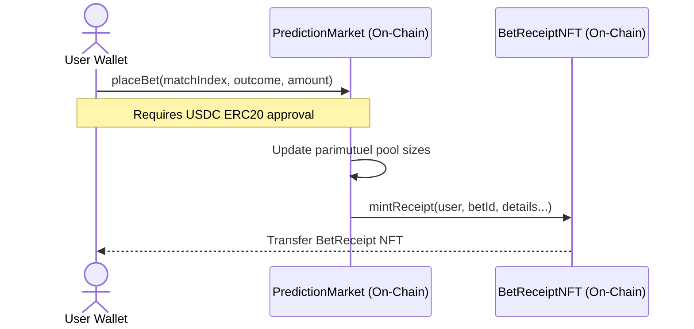
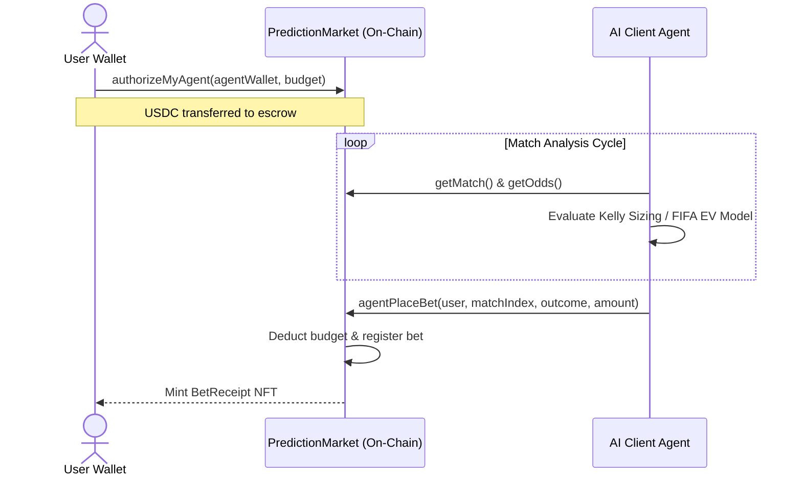

# 🔮 ArcMarkets — Predictive Markets on Arc Network

[](https://rpc.testnet.arc.network)
[](https://testnet.arcscan.app)
[](./LICENSE)

ArcMarkets is a decentralized, peer-to-peer prediction protocol built on the **Arc Network**. By leveraging Arc's native USDC gas model, ArcMarkets allows users to deposit, place wagers, receive returns, and settle gas fees completely in USDC, removing standard onboarding barriers associated with native gas tokens (like ETH).

---

## 🚀 Key Innovations

### 1. Dynamic Parimutuel Pooling
Unlike peer-to-peer orderbooks which require direct counterparties, all wagers consolidate into a unified on-chain pool. Odds adjust dynamically in real time based on wager distribution:
$$\text{Odds}_i = \frac{\text{Total Pool} \times (1 - \text{Fee})}{\text{Outcome Pool}_i}$$

### 2. Escrowed AI Agent Delegation
Escrow a USDC budget on-chain and authorize an off-chain AI agent to analyze sports fixtures (using FIFA ratings) and place wagers based on the **Kelly Criterion**—all without sharing private keys.

### 3. 100% On-Chain SVG NFT Receipts
Every bet mints an ERC-721 token containing an SVG receipt generated directly by the smart contract. The bet amount, teams, prediction type, and transaction timestamp are encoded on-chain in base64.

---

## 🛠️ Codebase Architecture

```
ArcMarkets/
├── contracts/
│   ├── PredictionMarket.sol   # Core parimutuel pooling & budget escrow
│   ├── BetReceiptNFT.sol      # On-chain dynamic SVG receipt NFT generator
│   └── MockUSDT.sol           # Mock ERC-20 token for local development
├── scripts/
│   ├── deploy.js              # Contract compilation and deployment script
│   ├── create-match.js        # Admin match creator
│   ├── resolve-match.js       # Admin match outcome resolver
│   ├── add-live-matches.js    # Seed live matches data
│   ├── resolve-all-live.js    # Settlement utility for seed matches
│   ├── authorize-agent.js     # Admin script to whitelist agent addresses
│   ├── fund-agent.js          # Escrow funding utility
│   ├── check-contracts.js     # Deployment state validator
│   └── check-min-bet.js       # Betting limits validator
├── frontend/
│   ├── src/
│   │   ├── agent/             # ArcMarketsAgent.js (Kelly Criterion client engine)
│   │   ├── app/               # Next.js layout, styles, API routes, and views
│   │   ├── hooks/             # custom react hooks (useMatches, useWallet, useAgent)
│   │   └── utils/             # ethers client configs and contract ABIs
│   └── package.json           # Frontend next.js build dependencies
├── hardhat.config.js          # Hardhat configuration with Arc Testnet network settings
├── WHITEPAPER.md              # In-depth mathematical and engineering whitepaper
└── package.json               # Root hardhat workspace setup
```

---

## 📊 Interaction Flowcharts

### On-Chain Betting Flow


### Escrowed AI Agent Run Cycle


---

## 🌐 Deployed Addresses

All contracts are deployed on the official **Arc Testnet** (Chain ID: `5042002`):

| Contract | Address | Explorer Link |
|---|---|---|
| **PredictionMarket** | `0xbE2bf8f1c34a0517Dfd8732d4b8A82056DB539B4` | [View on Arcscan](https://testnet.arcscan.app/address/0xbE2bf8f1c34a0517Dfd8732d4b8A82056DB539B4) |
| **BetReceiptNFT** | `0xEfDdb2C5788E426d0AE18a62B74a84A8c86972dE` | [View on Arcscan](https://testnet.arcscan.app/address/0xEfDdb2C5788E426d0AE18a62B74a84A8c86972dE) |
| **Mock USDC (Predeploy)** | `0x3600000000000000000000000000000000000000` | [View on Arcscan](https://testnet.arcscan.app/address/0x3600000000000000000000000000000000000000) |

---

## ⚡ Quick Start

### 1. Prerequisites
- **Node.js** v18 or higher
- **MetaMask** or any EIP-1193 wallet configured with Arc Testnet
- Testnet gas USDC obtained from the [Circle Gas Faucet](https://faucet.circle.com/) (select Arc Testnet)

### 2. Installation
Install root development tools and frontend Next.js packages:
```bash
# Root directory dependencies
npm install

# Frontend client dependencies
cd frontend && npm install && cd ..
```

### 3. Environment Variables Setup
Configure a `.env` file at the root:
```env
PRIVATE_KEY=your_admin_private_key_here
USDC_ADDRESS=0x3600000000000000000000000000000000000000
```

Configure `frontend/.env.local` for the client DApp:
```env
NEXT_PUBLIC_ARC_RPC_URL=https://rpc.testnet.arc.network
NEXT_PUBLIC_USDC_ADDRESS=0x3600000000000000000000000000000000000000
NEXT_PUBLIC_MARKET_ADDRESS=0xbE2bf8f1c34a0517Dfd8732d4b8A82056DB539B4
NEXT_PUBLIC_NFT_ADDRESS=0xEfDdb2C5788E426d0AE18a62B74a84A8c86972dE
```

### 4. Running the DApp
Launch the Next.js frontend server:
```bash
cd frontend
npm run dev
```
Open [http://localhost:3000](http://localhost:3000) in your web browser.

---

## 🔨 Hardhat Administrative Scripts

To execute admin operations, use the following CLI commands:

```bash
# Compile Smart Contracts
npx hardhat compile

# Deploy Contracts (Updates deployment.json)
npx hardhat run scripts/deploy.js --network arcTestnet

# Verify Deployment Configuration
npx hardhat run scripts/check-contracts.js --network arcTestnet

# Seed Initial Fixtures/Matches
npx hardhat run scripts/add-live-matches.js --network arcTestnet

# Authorize an AI Agent wallet
AGENT=0xYourAgentAddress npx hardhat run scripts/authorize-agent.js --network arcTestnet

# Resolve a Match Outcome
MATCH_INDEX=0 RESULT=1 npx hardhat run scripts/resolve-match.js --network arcTestnet
```

---

## 📘 Deep Dive Technical Details
For an in-depth breakdown of the pricing mechanics, the Kelly sizing derivation formulas, and risk multiplier tables, see the [WHITEPAPER.md](./WHITEPAPER.md).

---

_Built with 💜 on Arc Testnet._