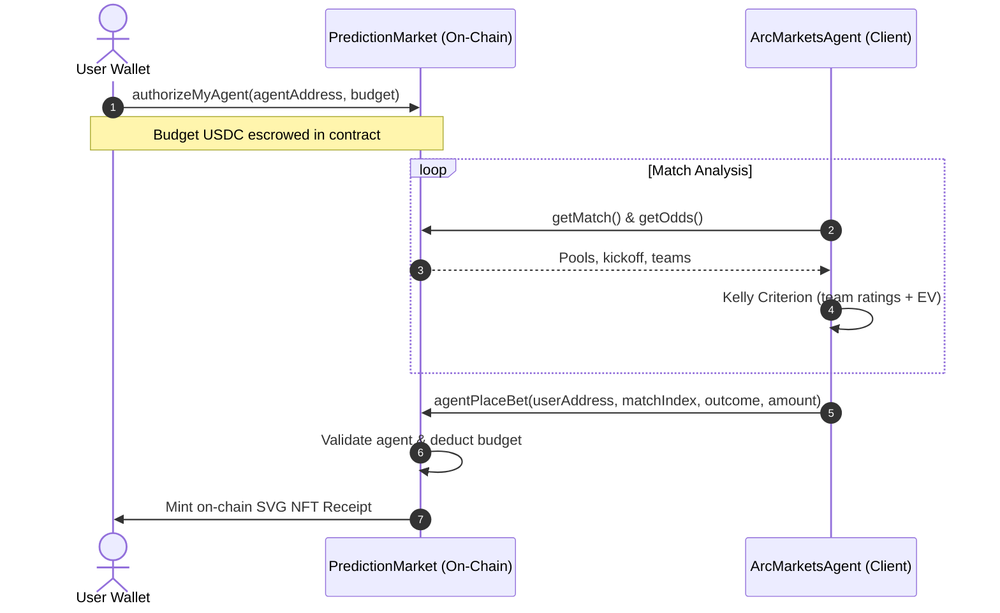

# ArcMarkets: Next-Generation Predict-to-Earn Protocol on the Arc Network

## Abstract
This paper details **ArcMarkets**, a decentralized, peer-to-peer parimutuel prediction market protocol deployed on the Arc Network. ArcMarkets introduces two core architectural improvements: (1) **Autonomous AI Agent Delegation**, allowing users to escrow funds on-chain and authorize specialized agents to place mathematically optimized wagers using a fractional Kelly Criterion model, and (2) **100% On-Chain SVG NFT Receipts**, encoding prediction parameters, outcomes, and metadata entirely in Solidity without external storage dependencies (IPFS/Arweave). Leveraging the native USDC gas model of the Arc Network, ArcMarkets provides a seamless, low-friction UX suited for both institutional hedging and consumer-grade prediction markets.

---

## 1. Introduction
Traditional prediction markets and betting platforms suffer from severe structural deficiencies:
1. **High Spread & Counterparty Risk:** Bookmakers skew odds to guarantee a profit margin, forcing retail participants to play against high-margin house models.
2. **Onboarding & Gas Friction:** Most EVM networks require participants to hold a native volatile asset (e.g., ETH) to cover transaction fees, creating a steep entry barrier.
3. **Execution Complexity:** Placing optimal bets requires continuous monitoring, quantitative modeling of probabilities, and active risk sizing—tasks that are highly demanding for average participants.

**ArcMarkets** addresses these inefficiencies by building directly on the **Arc Network**, utilizing **native USDC gas integration**, and pairing on-chain parimutuel liquidity pools with a delegated, mathematically driven client-side AI agent.

---

## 2. Parimutuel Pool Odds Pricing Model
Unlike peer-to-peer orderbooks or Constant Product Market Makers ($x \cdot y = k$), ArcMarkets implements a **Parimutuel Pooling Engine** where all bets on a specific event are aggregated into a single outcome-based liquidity pool.

### 2.1 Mathematical Formulation
Let $S = \{1, 2, 3\}$ represent the discrete set of prediction outcomes for an event:
- $1$: Home Win
- $2$: Draw
- $3$: Away Win

Let $L_i$ denote the total liquidity (amount of USDC) wagered on outcome $i \in S$. The total pool size $T$ is defined as:
$$T = \sum_{j \in S} L_j$$

Upon match resolution, a platform fee rate $f$ (where $f = 0.02$, equivalent to 200 basis points) is deducted from the total pool to fund protocol operations and agent incentives:
$$T_{\text{net}} = T \cdot \left(1 - f\right)$$

The dynamic decimal odds $O_i$ for outcome $i \in S$ are computed continuously on-chain as:
$$O_i = \begin{cases} 
      \frac{T \cdot (1 - f)}{L_i} & \text{if } L_i > 0 \\
      O_{\text{fallback}, i} & \text{if } L_i = 0 
   \end{cases}$$

Where the fallback odds (in basis points) are set to:
- $O_{\text{fallback}, 1} = 2.0\text{x}$ (20,000 basis points)
- $O_{\text{fallback}, 2} = 3.0\text{x}$ (30,000 basis points)
- $O_{\text{fallback}, 3} = 2.0\text{x}$ (20,000 basis points)

### 2.2 Payout Distribution
For a winning bet of magnitude $w$ placed on the winning outcome $i^*$, the payout $P(w)$ is proportional to the bettor's share of the winning pool:
$$P(w) = \frac{w}{L_{i^*}} \cdot T_{\text{net}} = w \cdot O_{i^*}$$

If an event is cancelled, the protocol reverts to capital preservation mode, and all wagers are returned in full without fees:
$$P(w) = w$$

---

## 3. Escrowed AI Agent Delegation
To automate market participation without sacrificing security, ArcMarkets features an on-chain/off-chain hybrid delegation model.

### 3.1 Escrow Architecture
1. **User Authorization:** The user calls `authorizeMyAgent(agent, budget)` on-chain, transferring the specified USDC budget directly into the `PredictionMarket` escrow pool.
2. **Sovereignty Retention:** At no point does the AI agent hold the user's private keys or have withdrawal access. The agent can only trigger `agentPlaceBet()` using the user's designated escrow balance.
3. **Instant Revocation:** The user can call `revokeAgent()` at any time. This action instantly resets the agent's permissions and transfers the remaining USDC budget back to the user's wallet.

---

## 4. The Kelly Sizing Engine
The off-chain client agent runs a quantitative prediction engine that evaluates teams and determines optimal risk sizing.

### 4.1 Probability Modeling
The model evaluates teams using FIFA strength ratings $R \in [0, 100]$. For a matchup between home team $H$ and away team $A$:
$$\Delta R = R_H - R_A$$

The historical win probabilities are estimated as:
$$p_H = \text{clamp}(0.15, 0.85, 0.50 + 0.004 \cdot \Delta R + 0.05)$$
$$p_A = \text{clamp}(0.15, 0.85, 0.50 - 0.004 \cdot \Delta R - 0.05)$$
$$p_D = \max(0.10, 1.00 - p_H - p_A)$$

### 4.2 Expected Value (EV) Formulation
For each outcome $i \in \{1, 2, 3\}$, the expected value $EV_i$ is computed relative to the current contract odds $O_i$:
$$EV_i = p_i \cdot O_i - 1$$

The agent identifies the optimal prediction outcome $i^*$:
$$i^* = \arg\max_{i \in S} EV_i$$

### 4.3 Sizing Formulation
The raw Kelly fraction $f^*$ represents the theoretically optimal portion of the capital to risk:
$$f^* = \max\left(0, \frac{p_{i^*} \cdot O_{i^*} - 1}{O_{i^*} - 1}\right) = \max\left(0, \frac{EV_{i^*}}{O_{i^*} - 1}\right)$$

In practice, the raw Kelly formula is highly volatile and susceptible to large drawdowns due to estimation errors in $p_i$. ArcMarkets applies an **Outcome Multiplier** $m_{\text{outcome}}$ and a safety fraction:
$$f_{\text{adj}} = \max(0, EV_{i^*}) \cdot m_{\text{outcome}} \cdot 0.25$$

The final bet size $S_{\text{suggested}}$ is capped relative to the total escrowed budget $B$ and a profile-specific maximum threshold $f_{\text{max}}$:
$$S_{\text{suggested}} = \min(B \cdot f_{\text{adj}}, B \cdot f_{\text{max}}, 100\text{ USDC})$$

### 4.4 Risk Management Profiles
The protocol defines three risk settings that govern execution:

| Parameter | Conservative | Moderate | Aggressive |
|---|---|---|---|
| **Min Confidence** ($p_{\text{thresh}}$) | $70\%$ | $55\%$ | $40\%$ |
| **Max Bet Percent** ($f_{\text{max}}$) | $5\%$ | $10\%$ | $20\%$ |
| **Outcome Multiplier** ($m_{\text{outcome}}$) | $0.8\text{x}$ | $1.0\text{x}$ | $1.2\text{x}$ |

An agent will skip execution if the scaled confidence falls below the profile's threshold:
$$\text{Confidence} = \min\left(100, \text{round}(p_{i^*} \cdot m_{\text{outcome}})\right) < p_{\text{thresh}}$$

---

## 5. 100% On-Chain SVG NFT Receipts
To eliminate dependence on centralized servers or peer-to-peer storage lookup times (which can lead to broken images or slow client renders), every prediction is accompanied by a unique ERC-721 token representing a receipt of the bet.

### 5.1 SVG Construction
The `BetReceiptNFT.sol` contract generates the graphics directly in Solidity using string concatenation:
- **Gradient Borders:** Uses CSS linear gradients to render theme-aware borders based on Arc's visual identity.
- **Dynamic Text Elements:** Renders match details (`homeTeam` vs `awayTeam`), selected prediction outcome, and the exact USDC amount.
- **Data Encoding:** The resulting XML markup is converted to standard Base64:
  $$\text{URI} = \text{"data:application/json;base64,"} + \text{Base64}(\text{JSON(Base64(SVG))})$$

This implementation guarantees that the visual representation of the prediction remains accessible as long as the underlying blockchain exists.

---

## 6. Arc Network Native Integrations
ArcMarkets is optimized for the **Arc Network** L2 infrastructure:
1. **USDC Native Gas Predeploy (`0x3600000000000000000000000000000000000000`):** Users do not need to wrap USDC or maintain gas reserves in native ETH. Wagers and transaction fees are paid natively using the exact same asset.
2. **Resilient Client RPC Architecture:** The client web interface proxies all node communication via a serverless Next.js API endpoint with local failover and 3-second cache-refresh rules.

---

## 7. Conclusion & Future Directions
ArcMarkets combines mathematical optimization (the Kelly Criterion), trustless wallet delegation, and on-chain visual rendering into a single, cohesive prediction application. Future upgrades will explore:
- **Decentralized Oracles:** Integrating Chainlink or API3 for automated match resolution.
- **Dynamic NFTs:** Adjusting SVG visual assets (color gradients, emojis) dynamically to indicate bet status changes (Pending $\rightarrow$ Won/Lost).
- **Gelato Automation:** Running autonomous cron agents to place wagers periodically without requiring user-side agent execution tasks.
