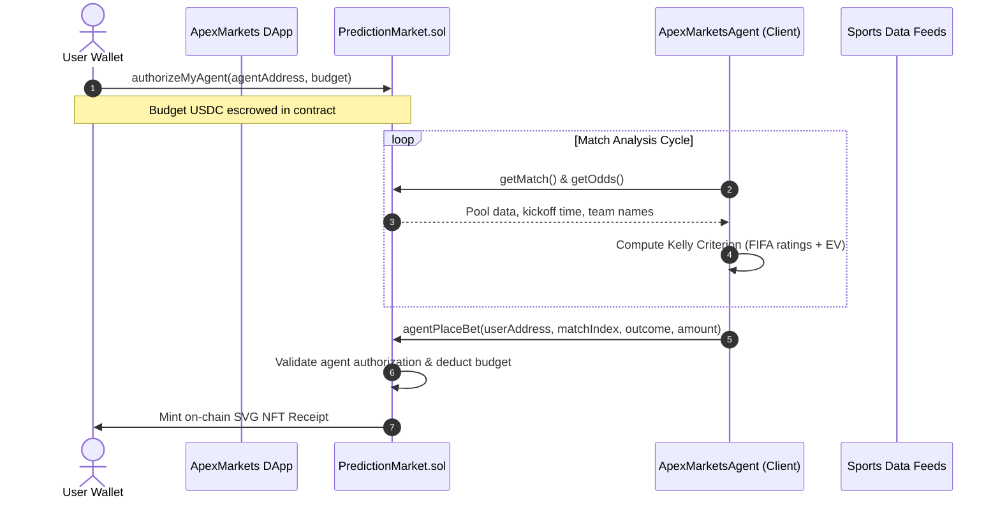

# ApexMarkets: A Next-Generation Predict-to-Earn Protocol Built on Arc Network

**Protocol Version:** 1.0  
**Network:** Arc Network Testnet (Chain ID: 5042002)  
**Status:** Live Deployment

---

## Abstract

This paper presents the technical specification of **ApexMarkets**, a decentralized peer-to-peer parimutuel prediction market protocol deployed on **Arc Network**. ApexMarkets introduces two core architectural innovations: **(1) Autonomous AI Agent Delegation**, enabling users to escrow USDC on-chain and authorize a specialized off-chain agent to place mathematically optimized wagers using a fractional Kelly Criterion model; and **(2) 100% On-Chain SVG NFT Receipts**, which encode prediction parameters, outcomes, and visual metadata entirely in Solidity without dependence on external storage layers such as IPFS or Arweave. By leveraging Arc Network's native USDC gas model, ApexMarkets delivers a seamless, low-friction user experience suited to both institutional hedging and consumer-grade prediction markets.

---

## 1. Introduction

Traditional prediction markets and sports betting platforms are structurally disadvantaged for retail participants across three primary dimensions:

1. **High Spread and Counterparty Risk.** Bookmakers systematically skew odds to guarantee a positive margin, forcing retail participants to compete against house models that guarantee long-run extraction of value from the user base.

2. **Onboarding and Gas Friction.** Most EVM-compatible networks require participants to hold a volatile native asset — typically ETH — solely to cover transaction fees. This creates a non-trivial entry barrier and exposes users to exchange-rate risk on a non-productive asset.

3. **Execution Complexity.** Placing mathematically optimal bets requires continuous market monitoring, real-time probability modeling, and disciplined risk sizing — a combination of demands that is impractical for the average participant.

**ApexMarkets** addresses these inefficiencies by deploying on **Arc Network**, utilizing **native USDC gas**, and pairing on-chain parimutuel liquidity pools with a delegated, quantitatively driven AI agent.

---

## 2. Parimutuel Pool Pricing Model

Unlike peer-to-peer order books or Constant Product Market Makers ($x \cdot y = k$), ApexMarkets implements a **Parimutuel Pooling Engine** in which all wagers on a specific event are aggregated into a single outcome-stratified liquidity pool.

### 2.1 Mathematical Formulation

Let $S = \{1, 2, 3\}$ denote the discrete set of prediction outcomes for a given event:

- $1$: Home Win  
- $2$: Draw  
- $3$: Away Win

Let $L_i$ denote the total USDC liquidity wagered on outcome $i \in S$. The total pool size $T$ is defined as:

$$T = \sum_{j \in S} L_j$$

Upon match resolution, a platform fee rate $f$ (where $f = 0.02$, equivalent to 200 basis points) is deducted to fund protocol operations and agent incentive structures:

$$T_{\text{net}} = T \cdot (1 - f)$$

Dynamic decimal odds $O_i$ for each outcome $i$ are computed continuously on-chain as follows:

$$O_i = \begin{cases} \dfrac{T \cdot (1 - f)}{L_i} & \text{if } L_i > 0 \\[10pt] O_{\text{fallback},\, i} & \text{if } L_i = 0 \end{cases}$$

Fallback odds apply when no capital has been wagered on a given outcome and are denominated in basis points:

| Outcome | Fallback Odds |
|---|---|
| Home Win ($i = 1$) | $2.0\times$ (20,000 bps) |
| Draw ($i = 2$) | $3.0\times$ (30,000 bps) |
| Away Win ($i = 3$) | $2.0\times$ (20,000 bps) |

### 2.2 Payout Distribution

For a winning wager of size $w$ placed on the winning outcome $i^*$, the payout $P(w)$ is proportional to the bettor's share of the winning pool:

$$P(w) = \frac{w}{L_{i^*}} \cdot T_{\text{net}} = w \cdot O_{i^*}$$

In the event of match cancellation, the protocol enters capital preservation mode and all wagers are returned in full without fee deduction:

$$P(w) = w$$

---

## 3. Escrowed AI Agent Delegation

ApexMarkets employs an on-chain/off-chain hybrid delegation architecture that enables autonomous market participation without compromising user custody.

### 3.1 Escrow Architecture

The delegation model is structured around three user-controlled operations:

1. **Agent Authorization.** The user calls `authorizeMyAgent(agent, budget)` on-chain, transferring the specified USDC amount directly into the `PredictionMarket` escrow pool and associating that balance with a designated agent wallet.

2. **Custody Retention.** At no point does the AI agent hold the user's private keys or possess withdrawal permissions. The agent is authorized exclusively to invoke `agentPlaceBet()` against the user's designated escrow balance.

3. **Instant Revocation.** The user may call `revokeAgent()` at any time. This operation immediately resets the agent's authorization and returns the remaining escrow balance to the user's wallet.

---

## 4. The Kelly Criterion Sizing Engine

The off-chain client agent executes a quantitative prediction pipeline that evaluates team strength and determines optimal wager sizing on a per-fixture basis.

### 4.1 Probability Modeling

Teams are evaluated using FIFA strength ratings $R \in [0, 100]$. For a matchup between home team $H$ and away team $A$:

$$\Delta R = R_H - R_A$$

Historical win probabilities are estimated as:

$$p_H = \text{clamp}_{[0.15,\, 0.85]}\!\left(0.50 + 0.004 \cdot \Delta R + 0.05\right)$$

$$p_A = \text{clamp}_{[0.15,\, 0.85]}\!\left(0.50 - 0.004 \cdot \Delta R - 0.05\right)$$

$$p_D = \max\!\left(0.10,\; 1.00 - p_H - p_A\right)$$

### 4.2 Expected Value Formulation

For each outcome $i \in S$, expected value $EV_i$ is computed against the current on-chain odds $O_i$:

$$EV_i = p_i \cdot O_i - 1$$

The agent selects the outcome with the highest expected value:

$$i^* = \underset{i \in S}{\arg\max}\; EV_i$$

### 4.3 Bet Sizing Formulation

The raw Kelly fraction $f^*$ defines the theoretically optimal proportion of capital to risk:

$$f^* = \max\!\left(0,\; \frac{p_{i^*} \cdot O_{i^*} - 1}{O_{i^*} - 1}\right) = \max\!\left(0,\; \frac{EV_{i^*}}{O_{i^*} - 1}\right)$$

In practice, the full Kelly formula is sensitive to estimation error in $p_i$ and can produce excessive drawdowns. ApexMarkets applies an **Outcome Multiplier** $m_{\text{outcome}}$ and a fixed safety scalar to derive a conservative adjusted fraction:

$$f_{\text{adj}} = \max(0,\; EV_{i^*}) \cdot m_{\text{outcome}} \cdot 0.25$$

The final suggested bet size $S_{\text{suggested}}$ is bounded by both the total escrowed budget $B$ and a profile-specific maximum threshold $f_{\text{max}}$:

$$S_{\text{suggested}} = \min\!\left(B \cdot f_{\text{adj}},\; B \cdot f_{\text{max}},\; 100\;\text{USDC}\right)$$

### 4.4 Risk Management Profiles

Three configurable risk profiles govern agent execution behavior:

| Parameter | Conservative | Moderate | Aggressive |
|---|---|---|---|
| Min Confidence ($p_{\text{thresh}}$) | $70\%$ | $55\%$ | $40\%$ |
| Max Bet Percent ($f_{\text{max}}$) | $5\%$ | $10\%$ | $20\%$ |
| Outcome Multiplier ($m_{\text{outcome}}$) | $0.8\times$ | $1.0\times$ | $1.2\times$ |

The agent skips execution on a given fixture if scaled confidence falls below the selected profile's threshold:

$$\text{Confidence} = \min\!\left(100,\; \text{round}(p_{i^*} \cdot m_{\text{outcome}})\right) < p_{\text{thresh}}$$

---

## 5. On-Chain SVG NFT Receipts

Every confirmed prediction is accompanied by a unique ERC-721 token that serves as a tamper-proof, permanently accessible receipt of the wager. By generating all visual assets directly on-chain, ApexMarkets eliminates dependence on centralized servers, IPFS gateways, or Arweave lookups — all of which are subject to latency, availability degradation, or permanent data loss.

### 5.1 SVG Construction

The `BetReceiptNFT.sol` contract constructs SVG markup natively in Solidity via string concatenation, incorporating the following elements:

- **Gradient Borders.** CSS linear gradients render theme-aware borders aligned with Arc Network's visual identity.
- **Dynamic Text Elements.** Match metadata — home team, away team, selected outcome, and USDC wager amount — are injected as inline SVG text nodes.
- **Base64 Encoding.** The resulting XML markup is serialized and encoded per the following URI scheme:

$$\text{tokenURI} = \texttt{"data:application/json;base64,"} + \text{Base64}\!\left(\text{JSON}\!\left(\text{Base64}(\text{SVG})\right)\right)$$

This implementation guarantees that the visual representation of every prediction remains fully accessible for as long as the underlying blockchain persists.

---

## 6. Arc Network Native Integrations

ApexMarkets is purpose-built for the **Arc Network** Layer 2 infrastructure and leverages two platform-native capabilities:

### 6.1 USDC Native Gas Predeploy

Arc Network exposes a native USDC gas predeploy at address `0x3600000000000000000000000000000000000000`. This allows users to pay transaction fees in the same USDC they use for wagering — removing the requirement to maintain a separate ETH balance and simplifying the user's asset management overhead entirely.

### 6.2 Resilient RPC Architecture

The frontend client proxies all node communication through a serverless Next.js API route with local failover logic and a 3-second cache-refresh interval. This architecture ensures stable RPC connectivity under degraded network conditions without requiring users to manage custom provider configurations.

---

## 7. Conclusion and Future Directions

ApexMarkets integrates three distinct technical primitives — parimutuel liquidity pooling, Kelly-optimized AI agent delegation, and fully on-chain visual NFT receipts — into a single cohesive prediction protocol. The result is a system that is mathematically rigorous, custody-safe, and architecturally independent of any centralized infrastructure.

Planned protocol upgrades include:

- **Decentralized Oracle Integration.** Replacing the current admin-based match resolution with on-chain oracle feeds via Chainlink or API3, enabling trustless, automated settlement.
- **Dynamic NFT State Transitions.** Updating SVG visual assets in-place — including color gradients and status indicators — to reflect real-time bet status transitions from `Pending` through `Won` or `Lost`.
- **Gelato Automation.** Deploying autonomous cron-based execution agents via Gelato Network, enabling the AI agent to place wagers on a scheduled basis without requiring user-initiated execution cycles.

---

## 8. Brand & Infrastructure Notice

**ApexMarkets** is an independent prediction market application built on top of **Arc Network**. Arc Network is blockchain infrastructure developed by Circle. ApexMarkets is not affiliated with, endorsed by, or sponsored by Circle or the Arc Network team. All brand assets, logos, and network names are used purely to describe the underlying infrastructure supporting the protocol.

---

*ApexMarkets Protocol — Technical Specification v1.0*
